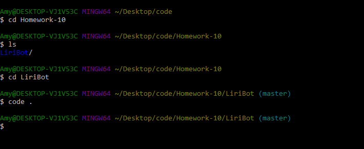
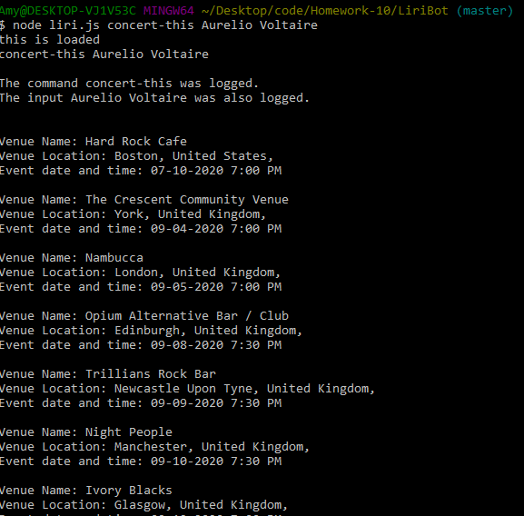
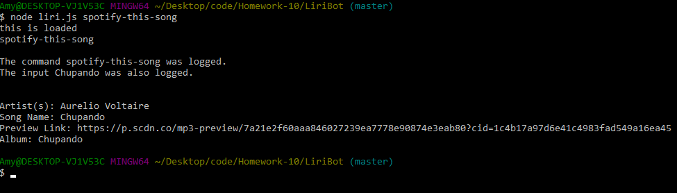
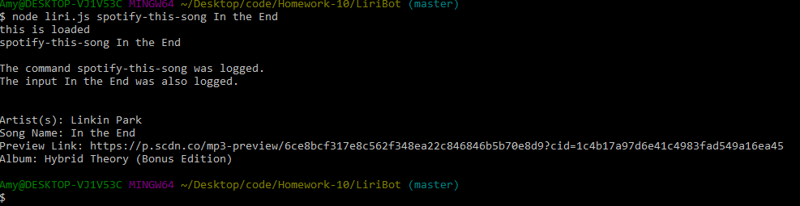
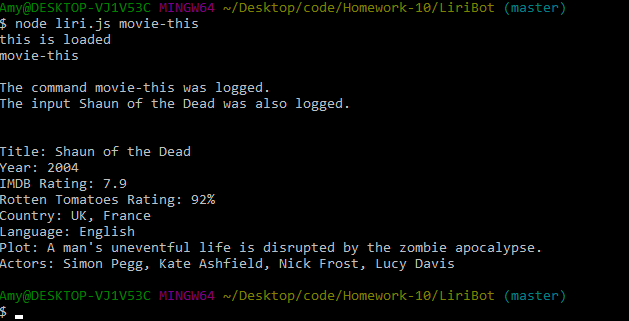
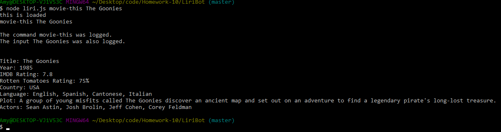
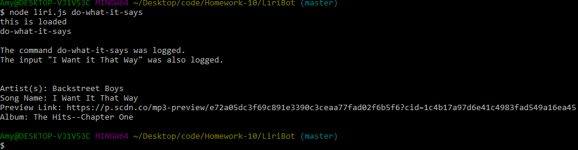
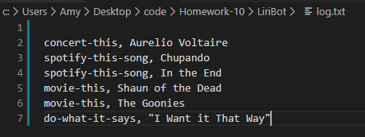

# LiriBot

https://github.com/jenross/liri-bot/blob/master/README.md

## Problem:

1. What:
    - To develop a comand-line application to provide information based on specific commands and user search input
2. Why: 
    - To provide the user with the ability to search and gather information on songs, concerts, and movies

## App Organization:
- It is organized into sections:
    - Concert
    - Music
    - Movie
    - Do what it says

## Instructions on how to run the App:
1. First, open up your terminal/bash window and navigate to the folder for liri-bot where the file liri.js is stored.

2. Next, type the command below onto the terminal/bash window to see the upcoming concert locations and dates for a specified artist:

        node liri.js concert-this <name of band/artist>

3. Thirdly, type the command below to see a song on Spotify associated with your search (if no song is typed, a default song of 'Chupando' will be displayed):

         node liri.js spotify-this-song <name of song>

4. Then, type the command below to see information pulled from the OMDB API about a specific movie(if no movie is entered, a default of 'Shaun of the Dead' will populate):

        node liri.js movie-this <name of movie>    

5. When type the command below, the program will read the random.txt file and run the command and search for its content:

        node liri.js do-what-it-says

6. Finally, when you type the information for concerts, artists, or movies, it will log into a file called log.txt:

## Technologies Used:
1. JavaScript
2. jQuery
3. APIs
    - Bands in Town
    - OMDB
4. Node Packages:
    - Node-Spotify-API
    - Moment
    - Dotenv
    - Axios
5. Git 

### Author:
Amy Haerr

### Collaborated with:
1. John Pendergrass
2. Zach Ledford
3. Haylee McLemore
4. Brooke Guarienti

